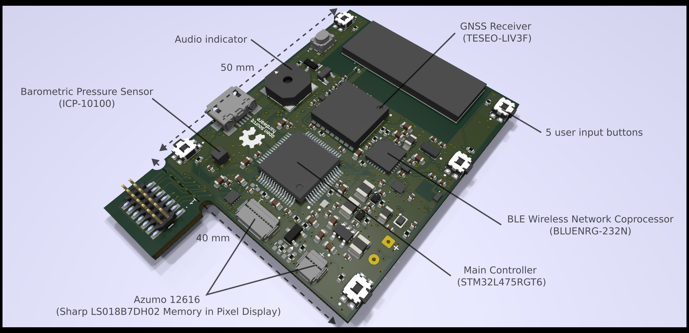
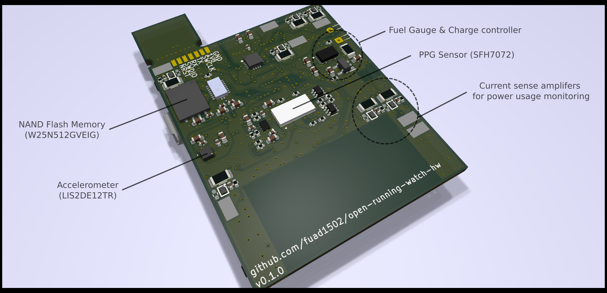

# *open-running-watch* (Hardware Repository)

An Open Source GPS Running Watch. 🏃⌚

> Note: This is the hardware repository. The firmware repository isn't available yet.




## Motivation

Running is my hobby, and ask anyone who has taken their running hobby seriously and they'll tell you having a GPS running watch is a must. Throughout my time using one, I sometimes encounter issues and thought to myself, "Why does it happen?", "I wish I had access to the raw data", "Why is the latest model way more expensive for just an additional sensor or software feature?", "I wish I could tune my watch to the way I wanted it, for longer battery life or better user experience", etc.

My wishes can only be fulfilled if there is a GPS running watch out there that is open sourced. Free for everyone to add their own software features, experiment with different algorithms, different chips, and produce their own customized hardware version, designed to exactly what they want.

I know what you're thinking. Who in the world would want that? Firstly, they have to be a runner, secondly, they have to be either a hardware geek and / or a software geek. Well, I am both! So I want it! And that's a good enough reason for me to build this 😁

However, in truth, that's not actually my main motivation for initiating this project. **My main motivation is I wanted to try out [Zephyr Project](https://www.zephyrproject.org/) on a complex embedded system.**

## Main components

- Main controller (STM32L475RGT6)
- Display (Azumo 12616: Sharp LS018B7DH02 Memory in Pixel Display)
- GPS receiver (TESEO-LIV3F)
- BLE wireless network coprocessor (BLUENRG-232N)
- Barometric pressure sensor (ICP-10100)
- Accelerometer (LIS2DE12TR)
- PPG Sensor (SFH7072)
- NAND Flash Memory (W25N512GVEIG)
- Fuel gauge & charge controller
- Audio indicator
- 5 user input buttons
- Current sense amplifiers for power usage monitoring in the development phase

## PCB Stackup

I use [JLCPCB JLC04161H-7628](https://jlcpcb.com/impedance) 4 layer stackup with the following signal assignments:

```
=========================
= (F.Cu) SIGNAL         =
=========================
PREPREG
=========================
= (In1.Cu) GROUND PLANE =
=========================
CORE
=========================
= (In2.Cu) POWER PLANE  =
=========================
PREPREG
=========================
= (B.Cu) SIGNAL         =
=========================
```

## Fabrication Files

You can download the released fabrication files tarball in the [Release](https://github.com/fuad1502/open-running-watch-hw/releases) tab. It contains:
- Schematic PDF.
- Top, bottom, and power plane PCB drawing.
- Gerbers.
- Bill of Materials.
